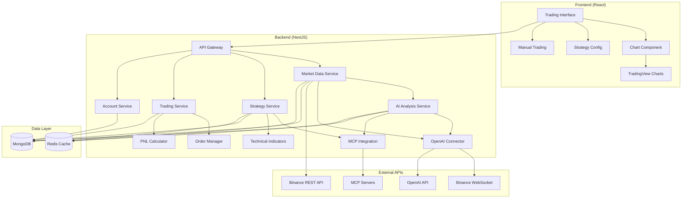

# Design Document

## Overview

K线策略模拟器是一个分布式的交易策略回测和手动交易模拟系统，采用前后端分离架构。后端使用NestJS提供RESTful API和WebSocket服务，前端使用React构建交互界面。系统通过Binance API获取实时和历史K线数据，支持多种交易策略的回测和手动交易模拟，所有数据存储在本地MongoDB数据库中。

## Architecture

### 系统架构图



### 技术栈

- **后端**: NestJS + TypeScript
- **前端**: React + TypeScript + Hooks
- **数据库**: MongoDB (主数据存储)
- **缓存**: Redis (实时数据缓存)
- **图表**: TradingView Charting Library
- **包管理**: pnpm
- **API集成**: binance-connector-js
- **AI分析**: OpenAI API + MCP (Model Context Protocol)

## Components and Interfaces

### 后端服务组件

#### 1. Market Data Service
负责K线数据的获取、存储和查询。

```typescript
interface MarketDataService {
  // 获取历史K线数据
  getHistoricalKlines(symbol: string, interval: string, startTime?: number, endTime?: number): Promise<KlineData[]>
  
  // 实时数据订阅
  subscribeKlineStream(symbol: string, interval: string): void
  
  // 存储K线数据
  saveKlineData(data: KlineData[]): Promise<void>
  
  // 获取支持的交易对
  getSupportedSymbols(): Promise<string[]>
}
```

#### 2. Strategy Service
处理交易策略的配置、执行和回测，支持插件化扩展。

```typescript
interface StrategyService {
  // 创建策略
  createStrategy(config: StrategyConfig): Promise<Strategy>
  
  // 执行回测
  runBacktest(strategyId: string, params: BacktestParams): Promise<BacktestResult>
  
  // 获取技术指标
  calculateIndicators(data: KlineData[], indicators: IndicatorConfig[]): Promise<IndicatorResult>
  
  // 策略信号生成
  generateSignals(strategy: Strategy, marketData: KlineData[]): Promise<TradingSignal[]>
  
  // 策略扩展管理
  registerStrategy(strategyClass: StrategyImplementation): void
  getAvailableStrategies(): StrategyMetadata[]
  
  // 指标扩展管理
  registerIndicator(indicatorClass: IndicatorImplementation): void
  getAvailableIndicators(): IndicatorMetadata[]
}
```

#### 3. Trading Service
处理交易执行、持仓管理和PNL计算。

```typescript
interface TradingService {
  // 执行交易
  executeTrade(order: TradeOrder): Promise<TradeResult>
  
  // 计算PNL
  calculatePNL(position: Position, currentPrice: number): Promise<PNLResult>
  
  // 获取账户信息
  getAccountInfo(): Promise<AccountInfo>
  
  // 获取持仓信息
  getPositions(): Promise<Position[]>
  
  // 获取交易历史
  getTradeHistory(filters: TradeHistoryFilter): Promise<TradeRecord[]>
}
```

#### 4. Account Service
管理账户状态、资金和风险控制。

```typescript
interface AccountService {
  // 初始化账户
  initializeAccount(initialBalance: number): Promise<Account>
  
  // 更新账户余额
  updateBalance(accountId: string, amount: number, type: 'credit' | 'debit'): Promise<void>
  
  // 计算保证金
  calculateMargin(position: Position): Promise<number>
  
  // 风险检查
  checkRisk(order: TradeOrder): Promise<RiskCheckResult>
}
```

#### 5. AI Analysis Service
提供基于OpenAI和MCP的数据分析功能。

```typescript
interface AIAnalysisService {
  // 市场数据分析
  analyzeMarketData(data: KlineData[], timeframe: string): Promise<MarketAnalysis>
  
  // 策略表现分析
  analyzeStrategyPerformance(backtest: BacktestResult): Promise<StrategyAnalysis>
  
  // 交易记录分析
  analyzeTradeHistory(trades: TradeRecord[]): Promise<TradingAnalysis>
  
  // 技术指标解读
  interpretTechnicalIndicators(indicators: IndicatorResult[]): Promise<IndicatorAnalysis>
  
  // 风险评估
  assessRisk(portfolio: Portfolio): Promise<RiskAssessment>
  
  // 生成交易建议
  generateTradingAdvice(context: TradingContext): Promise<TradingAdvice>
  
  // MCP工具调用
  callMCPTool(toolName: string, parameters: any): Promise<any>
}
```

### 前端组件

#### 1. Trading Interface
主交易界面组件。

```typescript
interface TradingInterfaceProps {
  symbol: string
  interval: string
  onSymbolChange: (symbol: string) => void
  onIntervalChange: (interval: string) => void
}
```

#### 2. Chart Component
K线图表显示组件。

```typescript
interface ChartComponentProps {
  klineData: KlineData[]
  indicators: IndicatorData[]
  trades: TradeRecord[]
  onChartReady: () => void
}
```

#### 3. Manual Trading Panel
手动交易操作面板。

```typescript
interface ManualTradingPanelProps {
  currentPrice: number
  accountInfo: AccountInfo
  onTrade: (order: TradeOrder) => void
  onNextKline: () => void
}
```

#### 4. AI Analysis Panel
AI分析结果展示面板。

```typescript
interface AIAnalysisPanelProps {
  marketData: KlineData[]
  tradingHistory: TradeRecord[]
  onAnalyze: (analysisType: AnalysisType) => void
  analysisResult?: AIAnalysisResult
  loading: boolean
}
```

## Data Models

### K线数据模型

```typescript
interface KlineData {
  symbol: string           // 交易对
  interval: string         // 时间间隔
  openTime: number        // 开盘时间
  closeTime: number       // 收盘时间
  open: number            // 开盘价
  high: number            // 最高价
  low: number             // 最低价
  close: number           // 收盘价
  volume: number          // 成交量
  quoteVolume: number     // 成交额
  trades: number          // 成交笔数
  takerBuyBaseVolume: number  // 主动买入成交量
  takerBuyQuoteVolume: number // 主动买入成交额
}
```

### 交易订单模型

```typescript
interface TradeOrder {
  id: string
  symbol: string
  side: 'BUY' | 'SELL'
  type: 'MARKET' | 'LIMIT'
  quantity: number
  price?: number
  leverage?: number        // 杠杆倍数（合约交易）
  marginType?: 'ISOLATED' | 'CROSS'  // 保证金模式
  timestamp: number
}
```

### 持仓模型

```typescript
interface Position {
  id: string
  symbol: string
  side: 'LONG' | 'SHORT'
  size: number            // 持仓数量
  entryPrice: number      // 开仓价格
  markPrice: number       // 标记价格
  leverage: number        // 杠杆倍数
  margin: number          // 保证金
  unrealizedPnl: number   // 未实现盈亏
  marginType: 'ISOLATED' | 'CROSS'
  openTime: number
}
```

### 策略配置模型

```typescript
interface StrategyConfig {
  id: string
  name: string
  type: string  // 支持动态策略类型
  version: string
  parameters: {
    [key: string]: any
  }
  symbols: string[]
  timeframe: string
  enabled: boolean
  metadata?: StrategyMetadata
}

// 策略元数据
interface StrategyMetadata {
  displayName: string
  description: string
  author: string
  version: string
  category: string
  tags: string[]
  parameterSchema: ParameterSchema[]
  requiredIndicators?: string[]
}

// 参数模式定义
interface ParameterSchema {
  name: string
  type: 'number' | 'string' | 'boolean' | 'array' | 'object'
  required: boolean
  defaultValue?: any
  min?: number
  max?: number
  options?: string[]
  description: string
}
```

### 技术指标模型

```typescript
interface IndicatorConfig {
  type: string  // 支持动态指标类型
  period: number
  parameters?: {
    [key: string]: any
  }
  metadata?: IndicatorMetadata
}

interface IndicatorResult {
  type: string
  values: number[] | { [key: string]: number[] }  // 支持多值指标
  signals?: TradingSignal[]
  metadata?: IndicatorMetadata
}

// 指标元数据
interface IndicatorMetadata {
  displayName: string
  description: string
  category: 'trend' | 'momentum' | 'volatility' | 'volume' | 'custom'
  outputType: 'single' | 'multiple'
  outputNames?: string[]  // 多值指标的输出名称
  parameterSchema: ParameterSchema[]
  chartType: 'overlay' | 'separate'
  colorScheme?: string[]
}
```

### AI分析结果模型

```typescript
interface MarketAnalysis {
  summary: string                    // 市场总结
  trend: 'BULLISH' | 'BEARISH' | 'SIDEWAYS'  // 趋势判断
  confidence: number                 // 置信度 (0-1)
  keyLevels: {                      // 关键价位
    support: number[]
    resistance: number[]
  }
  recommendations: string[]          // 交易建议
  riskFactors: string[]             // 风险因素
  timeframe: string
  generatedAt: number
}

interface StrategyAnalysis {
  performanceSummary: string         // 策略表现总结
  strengths: string[]               // 策略优势
  weaknesses: string[]              // 策略劣势
  improvementSuggestions: string[]   // 改进建议
  riskMetrics: {
    sharpeRatio: number
    maxDrawdown: number
    winRate: number
    profitFactor: number
  }
  marketConditionAnalysis: string    // 市场环境分析
}

interface TradingAnalysis {
  tradingPatterns: string[]          // 交易模式分析
  emotionalBias: string[]           // 情绪偏差识别
  timingAnalysis: string            // 时机分析
  positionSizing: string            // 仓位管理分析
  improvementAreas: string[]        // 改进领域
}

interface MCPToolResult {
  toolName: string
  parameters: any
  result: any
  executionTime: number
  success: boolean
  error?: string
}
```

## Error Handling

### 错误分类

1. **API错误**: Binance API调用失败
2. **数据错误**: 数据格式不正确或缺失
3. **业务错误**: 交易规则违反、余额不足等
4. **系统错误**: 数据库连接失败、服务不可用等

### 错误处理策略

```typescript
class ErrorHandler {
  // API错误处理
  handleApiError(error: BinanceApiError): void {
    switch (error.code) {
      case -1121: // Invalid symbol
        throw new BadRequestException('Invalid trading symbol')
      case -2010: // Insufficient balance
        throw new BadRequestException('Insufficient account balance')
      default:
        throw new InternalServerErrorException('Binance API error')
    }
  }
  
  // 重试机制
  async retryWithBackoff<T>(
    operation: () => Promise<T>,
    maxRetries: number = 3,
    baseDelay: number = 1000
  ): Promise<T> {
    for (let attempt = 1; attempt <= maxRetries; attempt++) {
      try {
        return await operation()
      } catch (error) {
        if (attempt === maxRetries) throw error
        await this.delay(baseDelay * Math.pow(2, attempt - 1))
      }
    }
  }
}
```

### 全局异常过滤器

```typescript
@Catch()
export class GlobalExceptionFilter implements ExceptionFilter {
  catch(exception: unknown, host: ArgumentsHost) {
    const ctx = host.switchToHttp()
    const response = ctx.getResponse<Response>()
    const request = ctx.getRequest<Request>()
    
    const status = exception instanceof HttpException 
      ? exception.getStatus() 
      : HttpStatus.INTERNAL_SERVER_ERROR
    
    const errorResponse = {
      statusCode: status,
      timestamp: new Date().toISOString(),
      path: request.url,
      message: exception instanceof HttpException 
        ? exception.message 
        : 'Internal server error'
    }
    
    response.status(status).json(errorResponse)
  }
}
```

## Testing Strategy

### 单元测试

1. **服务层测试**: 测试各个服务的核心业务逻辑
2. **工具函数测试**: 测试技术指标计算、PNL计算等工具函数
3. **数据模型测试**: 测试数据验证和转换逻辑

### 集成测试

1. **API测试**: 测试REST API端点的完整流程
2. **数据库测试**: 测试数据存储和查询功能
3. **WebSocket测试**: 测试实时数据流处理

### 端到端测试

1. **策略回测测试**: 测试完整的策略回测流程
2. **手动交易测试**: 测试手动交易的完整用户流程
3. **数据同步测试**: 测试Binance数据获取和存储流程

### 测试工具和框架

```typescript
// Jest配置示例
export default {
  moduleFileExtensions: ['js', 'json', 'ts'],
  rootDir: 'src',
  testRegex: '.*\\.spec\\.ts$',
  transform: {
    '^.+\\.(t|j)s$': 'ts-jest',
  },
  collectCoverageFrom: [
    '**/*.(t|j)s',
    '!**/*.spec.ts',
    '!**/node_modules/**',
  ],
  coverageDirectory: '../coverage',
  testEnvironment: 'node',
}
```

### 性能测试

1. **负载测试**: 测试系统在高并发下的表现
2. **压力测试**: 测试系统的极限处理能力
3. **内存泄漏测试**: 确保长时间运行的稳定性

### Mock策略

```typescript
// Binance API Mock
export class MockBinanceService {
  async getKlines(symbol: string, interval: string): Promise<KlineData[]> {
    return mockKlineData[symbol] || []
  }
  
  subscribeKlineStream(symbol: string, callback: (data: KlineData) => void): void {
    // 模拟实时数据推送
    setInterval(() => {
      callback(generateMockKlineData(symbol))
    }, 1000)
  }
}
```

## 部署和配置

### 环境配置

```bash
# .env 文件示例
# Binance API配置
BINANCE_API_KEY=your_api_key
BINANCE_SECRET_KEY=your_secret_key
BINANCE_BASE_URL=https://api.binance.com

# 数据库配置
MONGODB_URI=mongodb://localhost:27017/kline_simulator
REDIS_URL=redis://localhost:6379

# 应用配置
PORT=3000
NODE_ENV=development
JWT_SECRET=your_jwt_secret

# AI分析配置
OPENAI_API_KEY=your_openai_api_key
OPENAI_MODEL=gpt-4
MCP_SERVER_URL=http://localhost:8080

# 日志配置
LOG_LEVEL=info
LOG_FILE=logs/app.log
```

### Docker配置

```dockerfile
# Dockerfile示例
FROM node:18-alpine

WORKDIR /app

COPY package*.json ./
RUN npm ci --only=production

COPY . .
RUN npm run build

EXPOSE 3000

CMD ["npm", "run", "start:prod"]
```

### 数据库索引策略

```javascript
// MongoDB索引配置
db.klines.createIndex({ symbol: 1, interval: 1, openTime: 1 })
db.klines.createIndex({ symbol: 1, interval: 1, openTime: -1 })
db.trades.createIndex({ accountId: 1, timestamp: -1 })
db.strategies.createIndex({ userId: 1, enabled: 1 })
```

## 扩展性架构设计

### 策略扩展架构

系统采用插件化架构，支持动态加载和注册新的交易策略。

#### 策略基类和接口

```typescript
// 策略基类
abstract class BaseStrategy {
  protected config: StrategyConfig
  protected metadata: StrategyMetadata
  
  constructor(config: StrategyConfig) {
    this.config = config
    this.metadata = this.getMetadata()
  }
  
  // 必须实现的抽象方法
  abstract getMetadata(): StrategyMetadata
  abstract generateSignals(marketData: KlineData[], indicators: IndicatorResult[]): Promise<TradingSignal[]>
  abstract validateParameters(parameters: any): boolean
  
  // 可选重写的方法
  onInit?(): Promise<void>
  onDestroy?(): Promise<void>
  onMarketDataUpdate?(data: KlineData): Promise<void>
}

// 策略实现接口
interface StrategyImplementation {
  new (config: StrategyConfig): BaseStrategy
}

// 策略注册器
class StrategyRegistry {
  private strategies = new Map<string, StrategyImplementation>()
  
  register(type: string, strategyClass: StrategyImplementation): void {
    this.strategies.set(type, strategyClass)
  }
  
  create(config: StrategyConfig): BaseStrategy {
    const StrategyClass = this.strategies.get(config.type)
    if (!StrategyClass) {
      throw new Error(`Strategy type ${config.type} not found`)
    }
    return new StrategyClass(config)
  }
  
  getAvailable(): StrategyMetadata[] {
    return Array.from(this.strategies.values()).map(
      StrategyClass => new StrategyClass({} as any).getMetadata()
    )
  }
}
```

#### 策略示例实现

```typescript
// DCA策略实现示例
class DCAStrategy extends BaseStrategy {
  getMetadata(): StrategyMetadata {
    return {
      displayName: '定投策略',
      description: '定期定额投资策略',
      author: 'System',
      version: '1.0.0',
      category: 'investment',
      tags: ['dca', 'long-term'],
      parameterSchema: [
        {
          name: 'investmentAmount',
          type: 'number',
          required: true,
          min: 1,
          description: '每次投资金额'
        },
        {
          name: 'frequency',
          type: 'string',
          required: true,
          options: ['daily', 'weekly', 'monthly'],
          defaultValue: 'weekly',
          description: '投资频率'
        }
      ]
    }
  }
  
  async generateSignals(marketData: KlineData[], indicators: IndicatorResult[]): Promise<TradingSignal[]> {
    // DCA策略逻辑实现
    const signals: TradingSignal[] = []
    
    // 根据配置的频率生成买入信号
    if (this.shouldInvest(marketData[marketData.length - 1])) {
      signals.push({
        type: 'BUY',
        symbol: this.config.symbols[0],
        quantity: this.config.parameters.investmentAmount,
        price: marketData[marketData.length - 1].close,
        confidence: 1.0,
        reason: 'DCA定投信号'
      })
    }
    
    return signals
  }
  
  validateParameters(parameters: any): boolean {
    return parameters.investmentAmount > 0 && 
           ['daily', 'weekly', 'monthly'].includes(parameters.frequency)
  }
  
  private shouldInvest(currentKline: KlineData): boolean {
    // 根据频率判断是否应该投资
    // 实现具体的时间判断逻辑
    return true
  }
}
```

### 指标扩展架构

#### 指标基类和接口

```typescript
// 指标基类
abstract class BaseIndicator {
  protected config: IndicatorConfig
  protected metadata: IndicatorMetadata
  
  constructor(config: IndicatorConfig) {
    this.config = config
    this.metadata = this.getMetadata()
  }
  
  // 必须实现的抽象方法
  abstract getMetadata(): IndicatorMetadata
  abstract calculate(data: KlineData[]): Promise<IndicatorResult>
  abstract validateParameters(parameters: any): boolean
  
  // 获取所需的最小数据量
  getMinDataLength(): number {
    return this.config.period || 1
  }
}

// 指标实现接口
interface IndicatorImplementation {
  new (config: IndicatorConfig): BaseIndicator
}

// 指标注册器
class IndicatorRegistry {
  private indicators = new Map<string, IndicatorImplementation>()
  
  register(type: string, indicatorClass: IndicatorImplementation): void {
    this.indicators.set(type, indicatorClass)
  }
  
  create(config: IndicatorConfig): BaseIndicator {
    const IndicatorClass = this.indicators.get(config.type)
    if (!IndicatorClass) {
      throw new Error(`Indicator type ${config.type} not found`)
    }
    return new IndicatorClass(config)
  }
  
  getAvailable(): IndicatorMetadata[] {
    return Array.from(this.indicators.values()).map(
      IndicatorClass => new IndicatorClass({} as any).getMetadata()
    )
  }
}
```

#### 指标示例实现

```typescript
// MACD指标实现示例
class MACDIndicator extends BaseIndicator {
  getMetadata(): IndicatorMetadata {
    return {
      displayName: 'MACD',
      description: '移动平均收敛散度指标',
      category: 'momentum',
      outputType: 'multiple',
      outputNames: ['macd', 'signal', 'histogram'],
      chartType: 'separate',
      colorScheme: ['#2196F3', '#FF9800', '#4CAF50'],
      parameterSchema: [
        {
          name: 'fastPeriod',
          type: 'number',
          required: false,
          defaultValue: 12,
          min: 1,
          description: '快线周期'
        },
        {
          name: 'slowPeriod',
          type: 'number',
          required: false,
          defaultValue: 26,
          min: 1,
          description: '慢线周期'
        },
        {
          name: 'signalPeriod',
          type: 'number',
          required: false,
          defaultValue: 9,
          min: 1,
          description: '信号线周期'
        }
      ]
    }
  }
  
  async calculate(data: KlineData[]): Promise<IndicatorResult> {
    const { fastPeriod = 12, slowPeriod = 26, signalPeriod = 9 } = this.config.parameters || {}
    
    // MACD计算逻辑
    const ema12 = this.calculateEMA(data.map(d => d.close), fastPeriod)
    const ema26 = this.calculateEMA(data.map(d => d.close), slowPeriod)
    const macd = ema12.map((val, i) => val - ema26[i])
    const signal = this.calculateEMA(macd, signalPeriod)
    const histogram = macd.map((val, i) => val - signal[i])
    
    return {
      type: 'MACD',
      values: {
        macd,
        signal,
        histogram
      },
      metadata: this.metadata
    }
  }
  
  validateParameters(parameters: any): boolean {
    const { fastPeriod = 12, slowPeriod = 26, signalPeriod = 9 } = parameters || {}
    return fastPeriod > 0 && slowPeriod > 0 && signalPeriod > 0 && fastPeriod < slowPeriod
  }
  
  private calculateEMA(data: number[], period: number): number[] {
    // EMA计算实现
    const multiplier = 2 / (period + 1)
    const ema = [data[0]]
    
    for (let i = 1; i < data.length; i++) {
      ema[i] = (data[i] * multiplier) + (ema[i - 1] * (1 - multiplier))
    }
    
    return ema
  }
}
```

### 插件加载机制

```typescript
// 插件加载器
class PluginLoader {
  private strategyRegistry: StrategyRegistry
  private indicatorRegistry: IndicatorRegistry
  
  constructor() {
    this.strategyRegistry = new StrategyRegistry()
    this.indicatorRegistry = new IndicatorRegistry()
  }
  
  // 从文件系统加载插件
  async loadPluginsFromDirectory(pluginDir: string): Promise<void> {
    const pluginFiles = await fs.readdir(pluginDir)
    
    for (const file of pluginFiles) {
      if (file.endsWith('.plugin.js') || file.endsWith('.plugin.ts')) {
        await this.loadPlugin(path.join(pluginDir, file))
      }
    }
  }
  
  // 加载单个插件
  async loadPlugin(pluginPath: string): Promise<void> {
    try {
      const plugin = await import(pluginPath)
      
      // 注册策略
      if (plugin.strategies) {
        for (const [type, strategyClass] of Object.entries(plugin.strategies)) {
          this.strategyRegistry.register(type, strategyClass as StrategyImplementation)
        }
      }
      
      // 注册指标
      if (plugin.indicators) {
        for (const [type, indicatorClass] of Object.entries(plugin.indicators)) {
          this.indicatorRegistry.register(type, indicatorClass as IndicatorImplementation)
        }
      }
      
      console.log(`Plugin loaded: ${pluginPath}`)
    } catch (error) {
      console.error(`Failed to load plugin ${pluginPath}:`, error)
    }
  }
  
  // 热重载插件
  async reloadPlugin(pluginPath: string): Promise<void> {
    // 清除模块缓存
    delete require.cache[require.resolve(pluginPath)]
    await this.loadPlugin(pluginPath)
  }
}
```

### 插件开发规范

#### 插件文件结构

```
plugins/
├── my-strategy.plugin.ts
├── custom-indicators.plugin.ts
└── advanced-strategies/
    ├── index.plugin.ts
    ├── grid-strategy.ts
    └── arbitrage-strategy.ts
```

#### 插件开发模板

```typescript
// my-strategy.plugin.ts
import { BaseStrategy, BaseIndicator } from '../core/extensions'

// 导出策略
export const strategies = {
  'MY_CUSTOM_STRATEGY': class MyCustomStrategy extends BaseStrategy {
    getMetadata() {
      return {
        displayName: '我的自定义策略',
        description: '这是一个自定义策略示例',
        author: 'Developer',
        version: '1.0.0',
        category: 'custom',
        tags: ['custom', 'example'],
        parameterSchema: [
          // 参数定义
        ]
      }
    }
    
    async generateSignals(marketData, indicators) {
      // 策略逻辑实现
      return []
    }
    
    validateParameters(parameters) {
      // 参数验证
      return true
    }
  }
}

// 导出指标
export const indicators = {
  'MY_CUSTOM_INDICATOR': class MyCustomIndicator extends BaseIndicator {
    getMetadata() {
      return {
        displayName: '我的自定义指标',
        description: '这是一个自定义指标示例',
        category: 'custom',
        outputType: 'single',
        chartType: 'overlay',
        parameterSchema: [
          // 参数定义
        ]
      }
    }
    
    async calculate(data) {
      // 指标计算逻辑
      return {
        type: 'MY_CUSTOM_INDICATOR',
        values: [],
        metadata: this.metadata
      }
    }
    
    validateParameters(parameters) {
      // 参数验证
      return true
    }
  }
}
```

### 配置管理

```typescript
// 扩展配置
interface ExtensionConfig {
  pluginDirectories: string[]
  enableHotReload: boolean
  allowedPluginTypes: ('strategy' | 'indicator')[]
  securityPolicy: {
    allowFileSystemAccess: boolean
    allowNetworkAccess: boolean
    allowNativeModules: boolean
  }
}

// 在应用启动时加载扩展
class Application {
  private pluginLoader: PluginLoader
  
  async initialize() {
    this.pluginLoader = new PluginLoader()
    
    // 加载内置策略和指标
    await this.loadBuiltinExtensions()
    
    // 加载用户插件
    const config = await this.getExtensionConfig()
    for (const dir of config.pluginDirectories) {
      await this.pluginLoader.loadPluginsFromDirectory(dir)
    }
    
    // 启用热重载（开发模式）
    if (config.enableHotReload && process.env.NODE_ENV === 'development') {
      this.setupHotReload(config.pluginDirectories)
    }
  }
}
```

## 安全考虑

### API安全

1. **API密钥管理**: 使用环境变量存储敏感信息
2. **请求限制**: 实现请求频率限制防止滥用
3. **数据验证**: 严格验证所有输入数据

### 数据安全

1. **数据加密**: 敏感数据存储加密
2. **访问控制**: 实现基于角色的访问控制
3. **审计日志**: 记录所有重要操作的审计日志

### 网络安全

1. **HTTPS**: 所有API通信使用HTTPS
2. **CORS配置**: 正确配置跨域资源共享
3. **防火墙**: 配置适当的网络防火墙规则